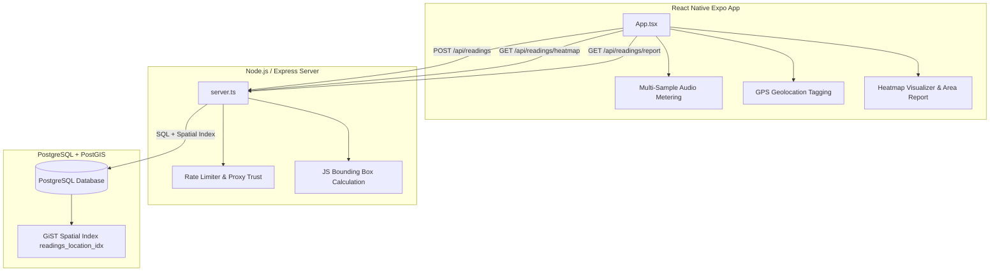

# Community Noise Map 🎧🗺️

A production-grade, full-stack crowdsourced mobile application and spatial database for mapping and analyzing urban noise pollution. Featuring a React Native / Expo mobile app, a Node.js Express REST API, and a PostgreSQL/PostGIS geospatial database.

---

## 🏛️ System Architecture

The application is structured into three primary layers, communicating securely via JSON REST endpoints:



---

## 🚀 Key Features

* **Multi-Sample Audio Metering**: Captures decibels by polling the hardware microphone every 100ms over a 700ms duration, filtering out noise floor anomalies, and calculating a precise average.
* **Premium Civic Dashboard**: Modern, glassmorphism dark-themed user interface (`#0B0F19`) featuring a dynamic gauge indicator that adapts to noise severity.
* **GiST Spatial Index Query Optimization**: Geospatial queries utilize the PostgreSQL GiST index via bounding box pre-filtering, preventing performance degradation over large datasets.
* **Memory Safety & Rate Limiting**: In-memory rate limiting with automated garbage-collection intervals protects the API from resource depletion.
* **Dual Test Attributes**: Full support for both React Native native tests (`testID`) and web/DOM test runners (`data-testid`).

---

## 🏎️ Database Spatial Index Performance

### The Bottleneck
A standard geography distance query like:
```sql
WHERE ST_DWithin(location::geography, ST_MakePoint(lng, lat)::geography, radius)
```
forces PostgreSQL to perform a full **Sequential Scan** (bypassing the spatial index) because the `location` column is cast to `geography` in the filter condition.

### The Optimization
To resolve this, we pre-filter the database search space using the **geometry bounding box operator (`&&`)** using degree boundaries calculated in JavaScript before checking the exact distance:
```sql
WHERE location && ST_MakeEnvelope(minLng, minLat, maxLng, maxLat, 4326)
  AND ST_DWithin(location::geography, ST_SetSRID(ST_MakePoint(lng, lat), 4326)::geography, radius)
```
This allows the PostgreSQL optimizer to perform a high-performance **Index Scan** using the GiST index (`readings_location_idx`), resulting in sub-millisecond query execution.

---

## 📡 API Reference

### 1. Health Status
* **Endpoint**: `GET /health`
* **Response**: `200 OK`
  ```json
  { "status": "ok" }
  ```

### 2. Submit Reading
* **Endpoint**: `POST /api/readings`
* **Rate Limit**: 1 request per IP address per minute.
* **Payload**:
  ```json
  {
    "latitude": 40.7128,
    "longitude": -74.006,
    "decibel": 65.4
  }
  ```
* **Response**: `201 Created`
  ```json
  {
    "status": "success",
    "id": 42
  }
  ```

### 3. Heatmap Data
* **Endpoint**: `GET /api/readings/heatmap`
* **Query Parameters**:
  * `lat` (number, required)
  * `lng` (number, required)
  * `radius` (number, meters, required)
  * `time_filter` (string, optional: `hour`, `day`, `all`)
* **Response**: `200 OK`
  ```json
  [
    {
      "latitude": 40.7128,
      "longitude": -74.006,
      "weight": 65.4
    }
  ]
  ```

### 4. Bounding Box Area Report
* **Endpoint**: `GET /api/readings/report`
* **Query Parameters**:
  * `minLng`, `minLat`, `maxLng`, `maxLat` (numbers, required)
* **Response**: `200 OK`
  ```json
  {
    "averageDecibel": 63.8,
    "peakDecibel": 75.2,
    "readingCount": 12
  }
  ```

---

## 🛠️ Setting Up and Running

### Prerequisites
* [Docker & Docker Compose](https://docs.docker.com/get-docker/)
* [Node.js 20 & npm](https://nodejs.org/)

### 1. Environment Configurations
Copy the template variables file into a local configuration:
```bash
cp .env.example .env
```

### 2. Run Backend Services (Docker Compose)
Build and spin up the PostgreSQL/PostGIS database and the Node.js Express server:
```bash
docker compose up --build -d
```
The server will boot up and automatically run the migrations inside `./db/migration.sql`. It exposes the REST API on port `3000`.

### 3. Run Mobile App (Expo Client)
Install the dependencies and start the React Native development server:
```bash
npm install
npm run start
```
You can scan the QR code using the Expo Go mobile app (iOS/Android) or run on web/simulator targets.